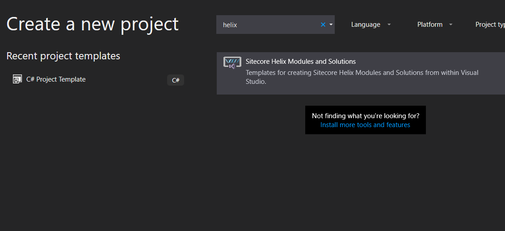
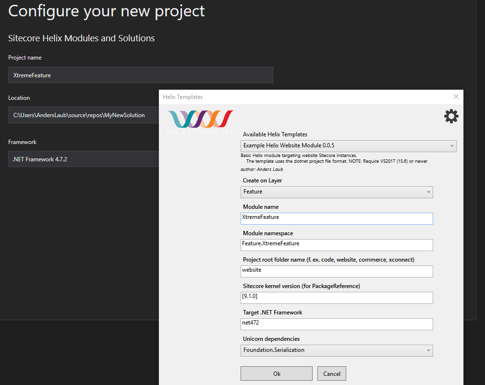

# Sitecore Helix Module & Solution Templates for VisualStudio

Visual Studio extension that accelerates creating new Visual Studio solutions and projects that follow the conventions described in Sitecore Helix.

**[Install extension from Visual Studio Marketplace](https://marketplace.visualstudio.com/items?itemName=AndersLaublaubplusco.SitecoreHelixVisualStudioTemplates)**

## Change log  

_2019-04-10 v0.9.9.10_

- Added Visual Studio 2019 support
- Added relative module folder path support
  - To support solution module templates to be under source control.
- Various bug fixes
- New example templates added out-of-the-box
  - _See the Helix MS Build example [here](https://github.com/LaubPlusCo/helix-msbuild-example) to learn more about the new templates that are now shipped as examples with the extension._
- SkipAttach paths in manifest
  - enables setting up templates that include TDS projects

More to come..

## Installation

The extension can be installed via Visual Studio Extensions and Updates

Visual Studio 2015 and 2017 are both supported but the built-in module templates does not support being loaded in Visual Studio 2015. You will need to make your own templates or upgrade VS.

> **Important Note:** You need to run Visual Studio as administrator to use this extension.  
> *Guide to always start Visual Studio as administrator*
> Right click a shortcut to Visual Studio 
>  
> - Select "Properties" 
> - Click "Open File Location"  
> - Right click "devenv.exe"  
> - Select "Troubleshoot compatibility"  
> - Select "Troubleshoot program"  
> - Check "The program requires additional permissions"  
> - Next, Test and Finish

When the extension has been installed a new project template is available under Visual C# templates.

In Visual Studio 2019 - Search for Helix to easily find the templates.

Using the template for the first time you will be asked to select a root directory for storing your Helix templates. This directory can be changed at any time from the Settings dialog. When an empty root folder is selected you will be asked if you want to install the built-in templates.

**New:** To keep your module templates under Source control you can add a folder in your repo root. The extension will automatically detect the folder and write a .helixtemplates configuration file with the relative folder path.

When selecting File > New Project the extension will presume that you are creating a new solution and filter the available templates so only solution templates are shown.

To add a new module click Add New project in the solution explorer. Note that you do not have to right-click the location you want the module placed. It is the template folder structure that dictates where the module is placed.

Always select the solution root folder when creating new modules. The template folder structure ensures that the module is placed correctly and will generate any missing folders.

## Footnotes

The included templates are only meant as examples - they can of course be used as is but please tailor the templates to match your customer solutions. Don't forget to think.

All code is released as open source under the ISC license.  
Please remember to include the original license in any derivatives.  
Anders Laub - contact@laubplusco.net